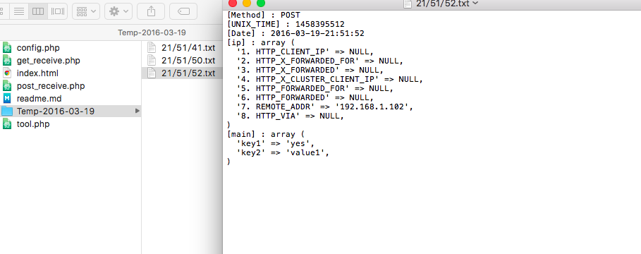

## 目的

單元測試 從手機端 往上送 的 參數是否正確

- [版本] : 
	- [1.0:base] : 透過 config.php 進行的設定
	- [2.0:GUI] : 用來單元測試用，可設定多組 group，並指定其一 group 進行資料取得

## readme

- config.php : 設定 key name
- post_receive.php : 用 post 去接收參數
- get_receive.php : 用 get 去接收參數

- receive 的 php 會取得以下資料，並存成 [Temp-日期]/[時間].txt 於資料夾中 
	- 使用方法
	- unix time
	- 日期 / 時間
	- 參數
	- ip位置



## 測試方法

- 透過 postMan 進行參數傳遞
	- post : body -> x-www-form-urlencoded
	- get  : Params
- 在 app 中，放入此 api，可測試上傳參數的單元測試 

## gitignore

```
Temp-*
Temp-*/*
```

# 2.0 GUI
- sqlite.db
	- keyGroups
		- id
		- keyArray : {key1,key2,key3,key4}
		- createDate
		- updateDate
		- createIp
	- selectGroup
		- id
		- KG_id

## To Do list

[進階版本]
- [ ] : group 概念 (顯示 目前 keyName 的設定)
	- 透過勾選，選定目前 要讀取的 keyName 格式
- [ ] : 畫面，可新增/刪除/修改 group，bootstrap
- [ ] : 更新完畢的 keyName，會寫入為 sqlite
	- 執行的 php receive 則從 sqlite 中取出參數

- [ ] : 將 db 資料 list 給 html
- [ ] : 似乎還是將 資料放入 CI 做 MVC 比較好...有 ctrl and view 的分開...會讓架構清楚些 
- [ ] : 在設定 item 中，加入回傳值的反饋。 